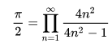
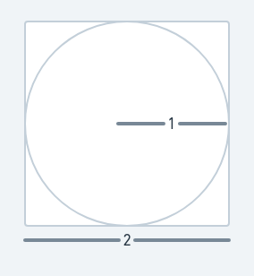

# Estimate pi 

## Using the Wallis formula

### Background

The [Wallis Formula](https://en.wikipedia.org/wiki/Wallis_product) can be
used to approximate the value of the constant 𝛑. 
The formula is like so 

Some more background is available at https://encyclopediaofmath.org/wiki/Wallis_formula

The estimates of PI increase as the number of terms in the equation
increase. When doing this using a computer, you will have a loop that
will run `n` times. The larger the value of `n`, the more terms there
will be and higher the accuracy of the estimate. 

### Exercise

Write a function called `wallis` in the file `estimate.py`.  It will
take the number of iterations and return the estimate of pi using the
wallis formula.

Implement this function using the above formula.

## Using a monte carlo simulation

### Background

Imagine a circle of radius 1. The area will be 𝛑*1*1 which is 𝛑. 
Now imagine a square that circumscribes this circle. The edge of the
square will be of length 2. Hence, the area of the square will
be 4. This is illustrated in the diagram below.

The ratio of the areas of the two shapes will be 

    area of circle          𝛑
    --------------   =    -----
    area of square          4

Hence the value of 𝛑 will be 4 times the ratio of the areas of the two
figures.

                     4 x area of circle
           𝛑     =   ------------------
                       area of square

The ratio of the areas can be estimated using a monte carlo 
simulation. 

### Monte carlo simulation

Imagine throwing a dart randomly onto the square. It will either be inside or
outside the circle. If we throw lots of darts, the ratio of the darts
inside the circle to the total number of darts will start to
approximate the ratio of the areas of the two figures. 

We can use this to get the ratio and then multiply that by 4 to get
the value of pi.

[Here](https://www.youtube.com/watch?v=ELetCV_wX_c) is a video of the
process to understand how it works

### Exercise
Implement a function called `monte_carlo` in the same file
`estimate.py` which should accept the number of iterations (the number
of darts thrown) as input and return the estimate of 𝛑.

### Implementation hints
The python `random` module a function called `random` which can be
used to return a random number (to simulate dart throws). It will
return numbers between 0 and 1 (i.e. all in the first quadrant of the
square).

Use the `random.random` twice per iteration to function to find a
random point `(x,y)` and then check whether it lies inside the circle
by calculating the distance between the point and `(0,0)`.

## Testing

You can simply run the file `estimate.py` like so

       python3 estimate.py
       
to check the whether your implementation is good.
